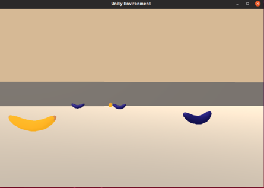

# Udacity Deep Reinforcment Learning Nanodegree 
## Project 1: Navigation:
 This is my implementation of Navigation project from Deep Reinforcement Learning Nanodegree (Udacity)

### Introduction

The goal for this project is to train an agent to navigate in a large, square world. In addition to navigation, the agent has to learn to collect yellow bananas, while avoiding the blue ones! 

| Screenshot of the environement | Obseravation State and Action  |
|---------------|-----------------|
|      | The environment has state space of 37(Vectorized space including agents velocity and the positions information of surrounding objects) and 4 discrete actions available: 0 - move forward. 1 - move backward. 2 - turn left. 3 - turn right.|

A reward of +1 is provided for collecting a yellow banana, and a reward of -1 is provided for collecting a blue banana.  

This task is episodic, and the condition to solve the environment is, to collect an average score of +13 or more, over 100 consecutive episodes.

You can learn more about the environment from the official Project instructions from Udacity [here](https://github.com/udacity/deep-reinforcement-learning/tree/master/p1_navigation)

### Setup Instructions:
#### 1. Requirements

To reproduce the results from this repository, it is suggested to use virtual python environment and python version 3.6. Python 3.7 at the point of creating this repository does not support tensorflow=1.7 which is a dependency of unityagents package. Follow this steps below :

```
git clone https://github.com/Jerome-Michael/NavigateAgent.git

cd NavigateAgent

python3 -m venv env_name

source env_name/bin/activate #for linux or

env_name\Scripts\activate.bat #for Windows.

pip install -r requirements.txt - local machine

!pip -q install ./python - to run on udacity workspace 

 ```
 
Next you need to download the unity environment for collecting bananas, you should first clone this repo and also download, the unity environment according to the OS you're using. The steps are:

1. Download the environment from one of the links below.  You need only select the environment that matches your operating system:
    - Linux: [click here](https://s3-us-west-1.amazonaws.com/udacity-drlnd/P1/Banana/Banana_Linux.zip)
    - Mac OSX: [click here](https://s3-us-west-1.amazonaws.com/udacity-drlnd/P1/Banana/Banana.app.zip)
    - Windows (32-bit): [click here](https://s3-us-west-1.amazonaws.com/udacity-drlnd/P1/Banana/Banana_Windows_x86.zip)
    - Windows (64-bit): [click here](https://s3-us-west-1.amazonaws.com/udacity-drlnd/P1/Banana/Banana_Windows_x86_64.zip)
    
2. Place the file in this folder, unzip (or decompress) the file and then write the correct path in the argument for creating the environment under the notebook `Navigation_DQN.ipynb`:

```python
env = env = UnityEnvironment(file_name="Banana_Linux/Banana.x86_64")

```    
### Description

- `dqn_agent.py`: code for the agent used in the environment
- `model.py`: code containing the Q-Network used as the function approximator by the agent
- `Navigation_DQN.ipynb`: notebook containing the solution
- `dqn.pth`: saved model weights for the original DQN model
- `ddqn.pth`: saved model weights for the Double DQN model
- `duel_dqn.pth`: saved model weights for the Dueling Double DQN model

### Instructions

Follow the instructions in `Navigation_DQN.ipynb` to get started with training your own agent! 
To watch a trained smart agent, follow the instructions below:

- **DQN**: If you want to run the original DQN algorithm, use the checkpoint `dqn.pth` for loading the trained model. Also, choose the parameter `qnetwork` as `QNetwork` while defining the agent and the parameter `update_type` as `dqn`.
- **Double DQN**: If you want to run the Double DQN algorithm, use the checkpoint `ddqn.pth` for loading the trained model. Also, choose the parameter `qnetwork` as `QNetwork` while defining the agent and the parameter `update_type` as `double_dqn`.
- **Dueling Double DQN**: If you want to run the Dueling Double DQN algorithm, use the checkpoint `duel_dqn.pth` for loading the trained model. Also, choose the parameter `qnetwork` as `DuelingQNetwork` while defining the agent and the parameter `update_type` as `double_dqn`.

### Results

Plot showing the score per episode over all the episodes.

| DQN | Double DQN | Dueling DQN |
:-------------------------:|:-------------------------:|:-------------------------:
 |   |  

I was able to solve the environment in 361 episodes in Double DQN! This was achieved after a careful hyperparameter tuning, leading to a significant improvement compared to the initial base case settings. The trained agent is shown below. You can also see, in the graph above, how the agent is improving it's score over the episodes. To read about the hyper-Parameters settings, read my [report](./Report.pdf)


| Trained Agent |
|---------------|
| | 


